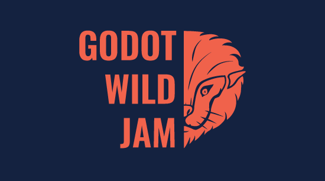

On my last post I mentioned that I entered a game jam called Godot Wild Jam. It was a fun time and I recommend doing one if you are interesting in game development or development in general. GdScript is an easy language to pick up and it has helped me with static typing going over to Typescript.



The premise for my game as simple: create a small static shooter with following the theme of the game jam. I deceided to use some open sourced assets for the game as I'm not that good at pixel art. I did make some edits on the assets for example the fish enemy I used was initially purple but I changed the colour to green and had a rotated image for the illusion of the asset moving.

The player would be an Inuit on a block of ice shooting fish. Nice and simple. The scene for the player would be called: `player.tscn`. The script attached to it would be `Player.gd`.

```gdscript
extends KinematicBody2D

var walkVelocity: = Vector2()

onready var _animated_sprite = $AnimatedSprite
onready var score: = 0

func _process(_delta: float) -> void:
	walkVelocity = Vector2()

	if Input.is_action_just_pressed("shoot",true) and Input.is_action_pressed("attack_activate"):
		shoot()
		_animated_sprite.play("Finish_Attack")
	# Movement
	if Input.is_action_pressed("attack_activate"):
		_animated_sprite.play("Set_Attack")
	else:
		_animated_sprite.play("Idle")
```

Pretty much this code is used to setup the player movement and action the shoot function is something that I created later on that will shoot the projectile at the enemy with the click of a button
